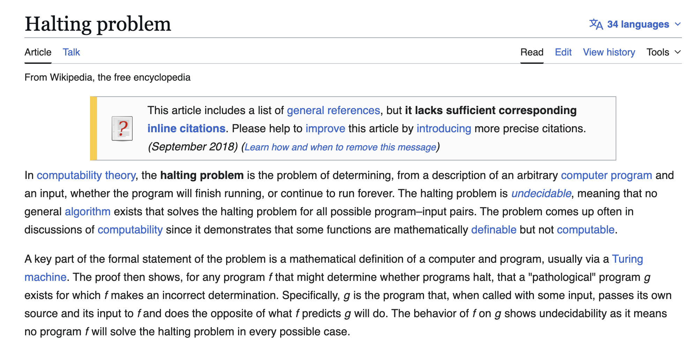

---
# Do You Love Coding?

## The Art of Universal Expression


*   Coding allows us to translate complex thoughts into functional reality.
*   **The Beauty of Universal Communication**: What makes coding truly fascinating is the underlying world of Automata Theory and Abstract Machines.
    *   These concepts define a *universal language* for logic.
*   **Turing's Profound Clarification**: Alan Turing, through his work culminating in the Halting Problem, clarified the fundamental distinction:
    *   **What is Computable**: What we can truly express, share, and solve universally with machines.
    *   **What is Uncomputable**: The inherent limits, what lies beyond algorithmic reach. This border has deep philosophical value.
*   **Coding as an Art**: We, as programmers, operate within these beautiful, defined boundaries. We harness this universal language, not just to build, but to craft logical expressions that resonate across all compatible machines. It's the art of translating thought into a precise, functional, and universally understood reality.
*   Today, we explore this profound border by focusing on **The Halting Problem**.


---
# What is The Halting Problem?



*   **The Question**: Given an arbitrary computer program (P) and an input (I), can we determine if the program will eventually finish running (halt) or continue forever (loop indefinitely)?
*   **Imagine a "Universal Debugger"**: A perfect algorithm, let's call it `Halts(P, I)`, that could infallibly tell you for *any* program and *any* input:
    *   "YES, it halts."
    *   "NO, it loops forever."
*   **Practical Relevance**: Think of debugging, AI safety, program analysis. Having such a tool would be incredibly powerful.
*   *But does such a universal tool exist?*

---
# Let's Prove the Halting Problem is Unsolvable

## Alan Turing's Proof by Contradiction (1936)

1.  **Assumption**: Let's *assume* our perfect `Halts(P, I)` function exists. It always outputs "YES" or "NO" and always halts itself.

2.  **Construct a Paradoxical Program `Q`**: We use `Halts` to build a new program, `Q(P)`:

    ```python
    def Q(P):
        # Step 1: Ask the H
		# "Does Program P halt on Input P?"
        answer = H(P, P)
		
		# Step 2: Do the Opposites
        if answer == "YES":
            Loop_Forever()
        else:
            Halt()
    ```
    *   `Q` takes a program `P` as input.
    *   `Q` asks `Halts` about `P` running on *itself* (`P` on `P`).
    *   `Q` then does the *opposite* of what `Halts` predicts.

3.  **The Critical Question**: What happens if we run `Q(Q)` (Program `Q` running on its own code `Q`)?

    *   **Case 1: If `Halts(Q, Q)` says "YES" (meaning `Q` halts on `Q`)**:
        *   Then `Q(Q)` goes into an infinite loop (by its own definition).
        *   **Contradiction!** `Halts` said `Q` halts, but `Q` actually loops.

    *   **Case 2: If `Halts(Q, Q)` says "NO" (meaning `Q` loops on `Q`)**:
        *   Then `Q(Q)` halts (by its own definition).
        *   **Contradiction!** `Halts` said `Q` loops, but `Q` actually halts.

4.  **Conclusion**: In both scenarios, our assumption that `Halts(P, I)` could exist leads to a logical contradiction. Therefore, **no such universal `Halts` algorithm can exist.** The Halting Problem is **undecidable**.

---
# Why Coding Makes Us Fall in Love?

## Embracing the Boundaries of Computation & Universal Truths

*   **A Fundamental Border**: The Halting Problem defines an unchangeable, theoretical limit. It's not about faster computers or more memory; it's what algorithms *cannot* do universally.
*   **Turing's Universal Language & Kant's A Priori**: This idea of a universal computational language echoes Immanuel Kant's concept of **"a priori" knowledge** – universal truths or structures of understanding that don't depend on specific experience. Both Turing's Universal Machine and Kant's a priori seek foundational, universal frameworks independent of empirical detail, one for computation, the other for human knowledge. This allows us to share and understand logical thoughts universally.
*   **Empowerment through Understanding**: This profound understanding doesn't diminish coding. It enriches it!
*   **The Power of the Possible**:
    *   We learn to recognize the difference between computable and uncomputable problems.
    *   We design elegant solutions *within* these profound limits.
    *   We appreciate the universal language these abstract models provide, allowing us to translate any logical thought into functional reality.
*   **Coding is a Dialogue**: It's a precise conversation with a machine, governed by universal rules. Understanding these rules, and their boundaries, elevates coding from a task to an art of logical expression and creative problem-solving.

---
# Q&A & Resources

*   **Ask me anything!**

*   **Recommended Reading:**
    *   [The Halting Problem](../../concepts/computability_theory/historical_foundations/HaltingProblem.md)
    *   [Abstract Machines: Definition, History, and Motivation](../../concepts/abstract_machines/AbstractMachines.md)
    *   [Computability and Algorithms](../../concepts/computability_theory/ComputabilityAndAlgorithms.md)
    *   [Roger Penrose and Non-Algorithmic Mind](../../concepts/computability_theory/historical_foundations/PenroseArguments.md) (for philosophical implications)

---
