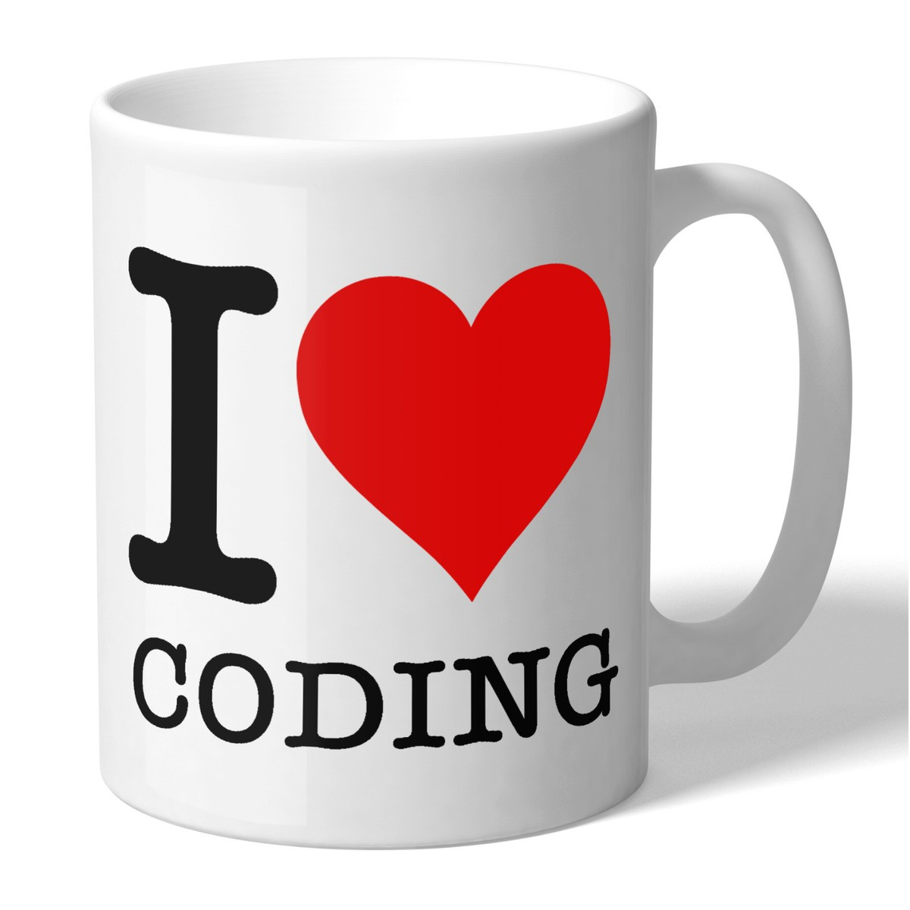
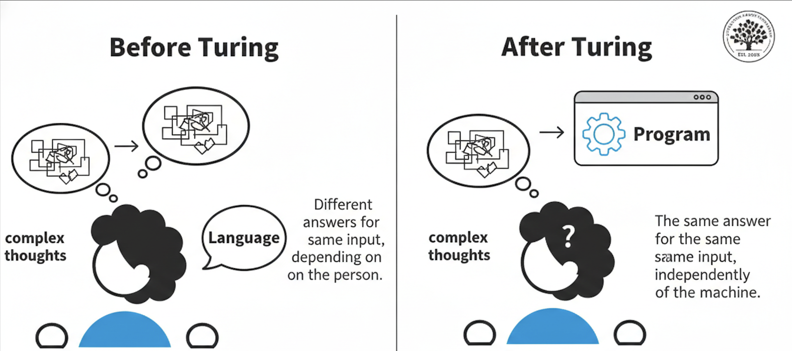
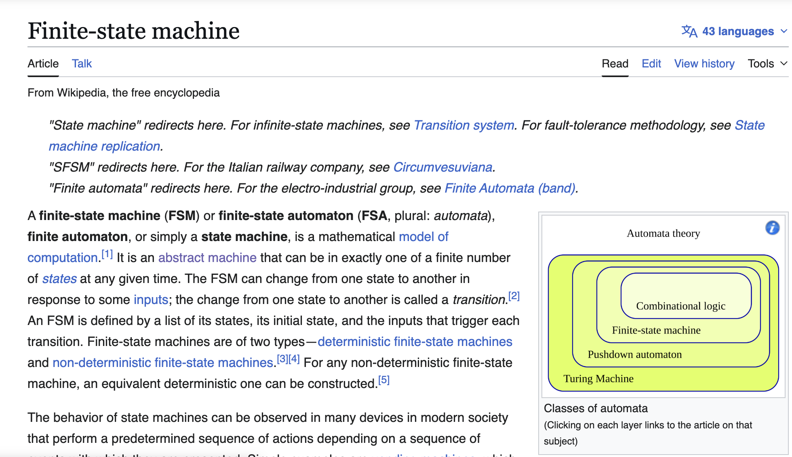
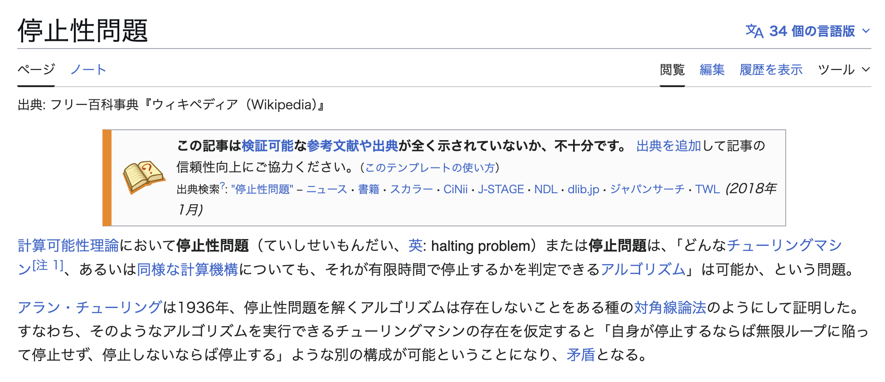
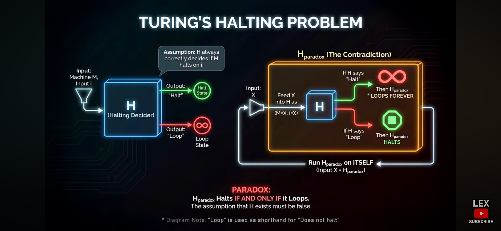

```python
def Q(P):
    # Step 1: Ask the H
	# "Does Program P halt on Input P?"
    answer = H(P, P)
	
	# Step 2: Do the Opposites
    if answer == "YES":
        Loop_Forever()
    else:
        Halt()
```


